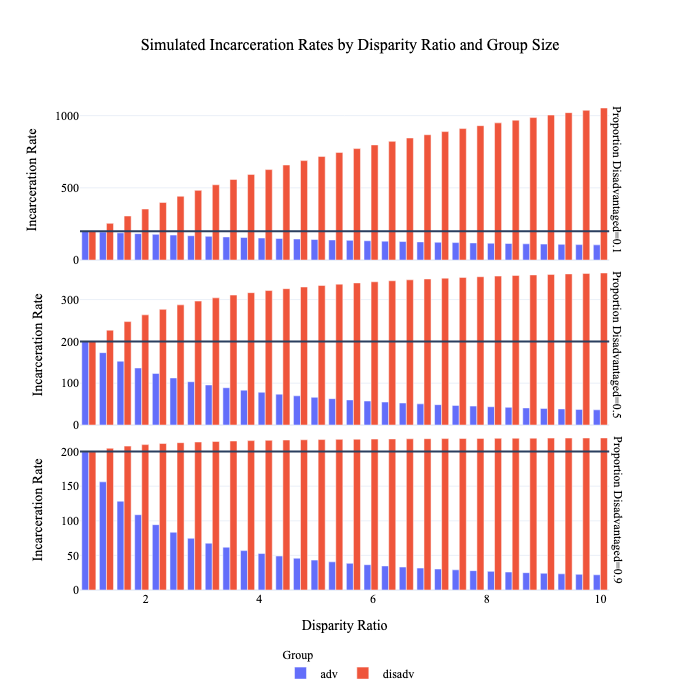
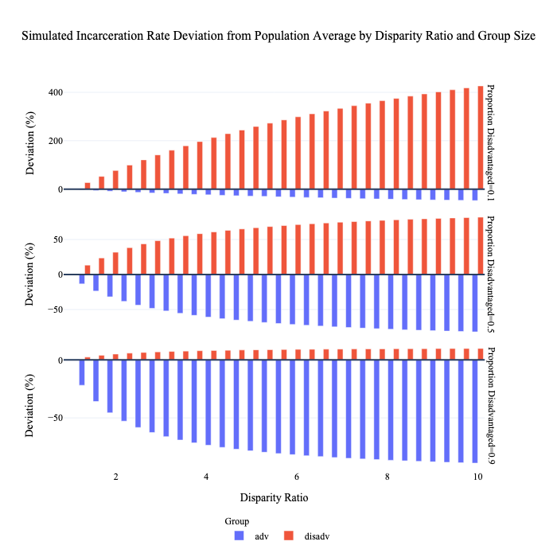
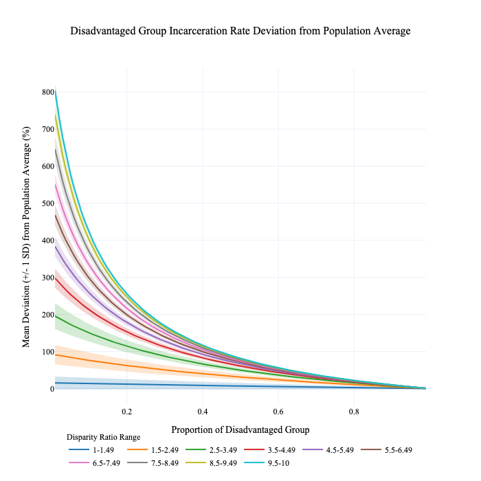
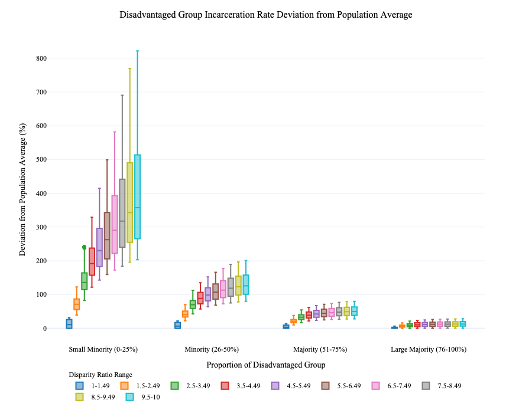
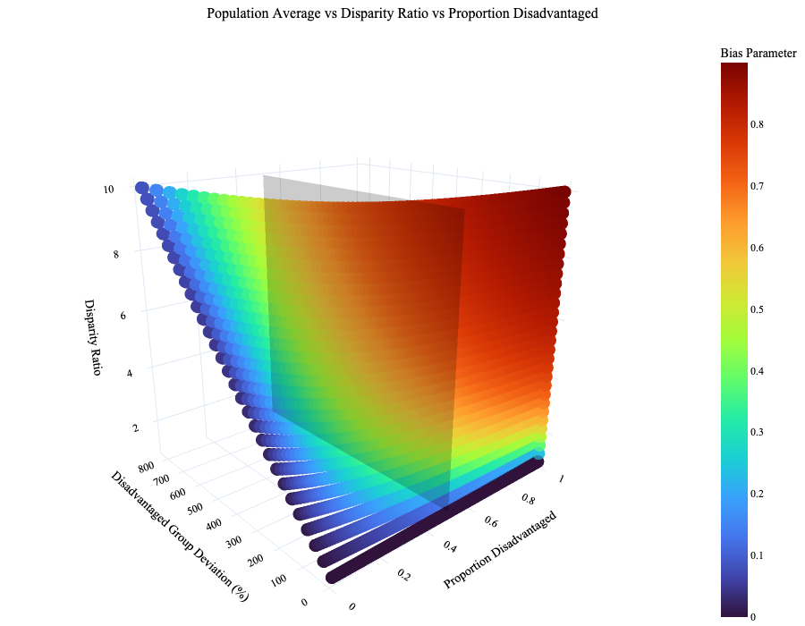
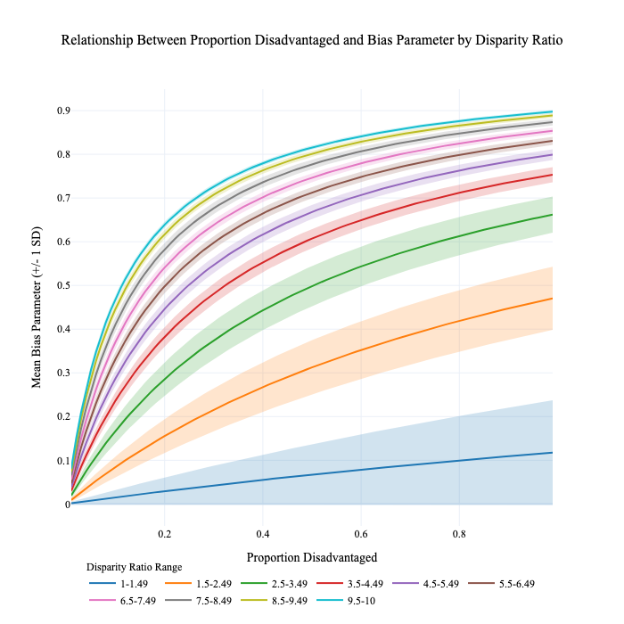

# Direct Pathway Analysis
This analysis explores how demographic group sizes mathematically constrain the relationship between population-wide incarceration rates and group-specific rates. We develop models that explicitly quantify these constraints and introduce metrics for comparing disparities across different demographic contexts. Our approach focuses on direct mathematical relationships rather than underlying causal mechanisms, complementing other analyses that examine how disparities emerge from social processes.

## Model Specification

Our analysis introduces two key mathematical frameworks: the Disparity-Controlled Redistribution Model and the Normalized Disparity Index (η). These models allow us to systematically examine how group proportions affect the possible range of incarceration disparities while maintaining fixed population-wide rates. The frameworks are particularly valuable for understanding why observed disparities may manifest differently in populations with varying demographic compositions, even when underlying discriminatory forces are similar.

### Disparity-Controlled Redistribution Model
The Disparity-Controlled Redistribution Model conceptualizes discrimination in punishment as a function of group membership while maintaining a constant population-wide incarceration rate. It introduces a parameter d that directly represents the disparity ratio between disadvantaged and advantaged groups (i.e., the disadvantaged group's incarceration rate is exactly d times that of the advantaged group). This approach ensures that the total "amount" of punishment in the system remains fixed, with changes in the disparity ratio d only affecting how that punishment is allocated across groups, not the overall incarceration level.

$$
\text{IncarcerationRate}\_{adv}(avgRate, d, p) = \frac{avgRate}{d \cdot p + (1-p)}
$$
and
$$
\text{IncarcerationRate}\_{disadv}(avgRate, d, p) = d \cdot \text{IncarcerationRate}\_{adv}
$$

Where:

$g \in G$ represents an individual's group membership
$d \geq 1$ is the disparity ratio between groups
$p$ is the proportion of the population in the disadvantaged group
$avgRate$ is the population average incarceration rate

This model maintains a constant population average incarceration rate for any value of $d$, as demonstrated by:

$$p \cdot \text{IncarcerationRate}\_{disadv} + (1-p) \cdot \text{IncarcerationRate}\_{adv} = avgRate$$

When we substitute the rate equations:

$$p \cdot d \cdot \frac{avgRate}{d \cdot p + (1-p)} + (1-p) \cdot \frac{avgRate}{d \cdot p + (1-p)} = avgRate$$

Factoring out common terms:

$$\frac{avgRate}{d \cdot p + (1-p)} \cdot (p \cdot d + (1-p)) = avgRate$$

This simplifies to:

$$avgRate \cdot \frac{d \cdot p + (1-p)}{d \cdot p + (1-p)}$$

Therefore:

$$avgRate = avgRate$$

Which confirms that the population-weighted average incarceration rate equals $avgRate$ for any value of $d$.

### The Normalized Disparity Index (η)
In our simulation, we compute the Normalized Disparity Index (η, eta) that accounts for relative group size differences when comparing disparity ratios. This index, derived from the Bias-Controlled Redistribution Model, conceptualizes discrimination as the degree to which punishment is redistributed between advantaged and disadvantaged groups. We assess how this metric behaves in our sensitivity analysis and evaluate its potential as a standardized measure for comparing disparities between populations with different group compositions.

#### Mathematical Definition
The Normalized Disparity Index is defined as:

$$\eta = \frac{d - 1}{d + \frac{1 - p}{p}}$$

Where:
* $d$: Disparity ratio — the ratio of rates between disadvantaged and advantaged groups
* $p$: Proportion of the disadvantaged group in the population

#### Derivation from Population Average Redistribution Modeling
The Normalized Disparity Index can be derived from a model of group outcomes:

$$\text{IncarcerationRate}(avgRate, g, \eta, p) = avgRate \cdot \text{GroupEffect}(g, \eta, p)$$

Where:

$$\text{GroupEffect}(g, \eta, p) =
\begin{cases}
1 + \eta \cdot \frac{1 - p}{p} & \text{if } g \in G_{\text{disadv}} \\
1 - \eta & \text{if } g \in G_{\text{adv}}
\end{cases}
$$

This can be viewed as a weighted decomposition of the population average incarceration rate. Rather than starting with group-specific rates, we can begin with the overall population average rate and then systematically allocate this rate between advantaged and disadvantaged groups according to the normalized disparity index. This means η controls how much the advantaged group's rate is discounted below the population average (by a factor of 1-η) and how much the disadvantaged group's rate is increased above the average (by a factor of 1+η·(1-p)/p). 

To derive the relationship between disparity ratio $d$ and the Normalized Disparity Index $\eta$, we start with the definition of disparity ratio:

$$d = \frac{\text{IncarcerationRate}\_{\text{disadv}}}{\text{IncarcerationRate}\_{\text{adv}}}$$

Substituting the rate formulas from the model:

$$d = \frac{avgRate \cdot (1 + \eta \cdot \frac{1-p}{p})}{avgRate \cdot (1-\eta)} = \frac{1 + \eta \cdot \frac{1-p}{p}}{1-\eta}$$

Solving for $\eta$:

$$d \cdot (1-\eta) = 1 + \eta \cdot \frac{1-p}{p}$$
$$d - d \cdot \eta = 1 + \eta \cdot \frac{1-p}{p}$$
$$d - 1 = d \cdot \eta + \eta \cdot \frac{1-p}{p}$$
$$d - 1 = \eta \cdot (d + \frac{1-p}{p})$$
$$\eta = \frac{d - 1}{d + \frac{1-p}{p}}$$

#### Interpretation
The Normalized Disparity Index can be understood as a fraction of two meaningful components:

$$\eta = \frac{\text{Excess Disparity}}{\text{Disparity + Group Size Imbalance}}$$

* **Excess Disparity** $(d - 1)$: Measures how much the disparity ratio exceeds equality
* **Disparity + Group Size Imbalance** $\left(d + \frac{1 - p}{p}\right)$: Accounts for both the magnitude of disparity and the population imbalance between groups

This index provides a standardized measure that inherently accounts for population composition when comparing disparities across different contexts, making it particularly valuable for cross-national or cross-temporal comparisons where group proportions may vary significantly.

## Sensitivity Analysis Approach & Results

Our analysis systematically explores how group size affects measured inequality across all three models through parameter variation:

1. **Parameter Selection**:
   * Set population proportions: p ∈ [0.1, 0.99], with 0.01 increments (90 values)
   * Choose average incarceration rates: range from 50 to 500 per 100,000, with 100 linear increments
   * Define disparity parameters for Standard Model: d ∈ [1, 10], with 30 values

2. **Factorial Design**:
   * Create a factorial design by systematically combining all selected parameter values for each model
        * This yields $n_p \times n_r \times n_d$ total simulation runs
            * 270,000 given our parameters

3. **For Each Scenario**:
   * Calculate group-specific incarceration rates according to each model
   * Calculate disparity measures:
      * DisparityDifference = Rate_disadv - Rate_adv
      * DisparityRatio(i.e. d) = Rate_disadv / Rate_adv 
      * Bias parameter = (DisparityRatio - 1)/(DisparityRatio + (1-p)/p)

4. **Analysis**:
   * Calculate deviation metrics for each group from the population average
   * Generate visualizations to explore relationships between parameters:
      * Explanatory visuals showing incarceration rates by disparity ratio and group size
      * Plots showing disadvantaged group's deviation from population average
      * Boxplots of disadvantaged group's deviation patterns
      * Line plots showing the relationship between proportion disadvantaged and bias parameter grouped by disparity ratio
      * 3D scatter plots showing relationships between proportion disadvantaged, disparity ratio, and bias parameter  
      

## Results

The analysis results are saved as CSV files in the `output/data` directory and visualized through multiple interactive plots saved in the `output/figures` directory as both HTML and PNG formats. 

### Conceptual Visualization of the Simulation

To help explain the analysis conceptually, we've created visualizations using exemplar values for the proportion of disadvantaged population. These visualizations demonstrate how the disparity-controlled redistribution model behaves under different conditions, particularly highlighting the mathematical constraints that group size places on possible incarceration rates.

The explanatory visuals below show incarceration rates for both advantaged and disadvantaged groups across different disparity ratios. We selected three representative population proportions (10%, 50%, and 90% disadvantaged) to illustrate a critical phenomenon: how group size inherently limits the possible range of incarceration rates while maintaining the same population average.

These visualizations demonstrate what Sebastian has termed the "ceiling effect" for large demographic groups. When a disadvantaged group constitutes a large proportion of the population (e.g., 90%), their incarceration rate cannot rise dramatically above the population average, regardless of the disparity ratio. This is a mathematical necessity - large groups cannot deviate substantially from the average they heavily influence. This mirrors the situation of Black South Africans, who, as a large majority of the population, cannot have incarceration rates dramatically higher than the national average due to statistical constraints.

Conversely, when the disadvantaged group is small (e.g., 10%), their incarceration rates can reach extremely high levels relative to the population average - similar to the case of Irish Travellers described by Sebastian, where small minority groups can experience incarceration rates orders of magnitude higher than the national average.

These visualizations help demonstrate how the proportion of disadvantaged population creates mathematical bounds on possible incarceration rates.

The first visualization shows absolute incarceration rates: 

The second shows the percentage deviation from the population average, highlighting how group size constrains possible outcomes:

### Analysis of Disadvantaged Group's Incarceration Rate Deviation from Population Average

This section examines how the disadvantaged group's absolute incarceration rate deviates from the population average across our simulation runs. The deviation is controlled by two key parameters: the disparity ratio (d) and the proportion of the disadvantaged population (p).

The first visualization shows how the percent deviation of the disadvantaged group's incarceration rate varies with population proportion:

This line chart bins simulation runs by disparity ratio ranges. It clearly demonstrates that when the disadvantaged group is a small proportion of the population (low p values), their incarceration rate can deviate exponentially from the population average. Conversely, when the disadvantaged group constitutes a large proportion of the population (high p values), their incarceration rate remains much closer to the population average, regardless of the disparity ratio.

The second visualization presents the same relationship using boxplots for four distinct demographic scenarios:

These boxplots categorize the disadvantaged group as a small minority, minority, majority, or large majority. The pattern reinforces our earlier observation: the potential for extreme deviation from the population average diminishes dramatically as the disadvantaged group's proportion increases, highlighting the mathematical constraints that group size places on possible incarceration rates.

### Analysis of Bias Parameter

During our analysis, we made an interesting discovery: the bias parameter (b) from the bias-controlled redistribution model can be calculated directly in terms of the disparity ratio and proportion disadvantaged. This insight led us to analyze this relationship across all simulation runs.

The 3D scatter plot below visualizes all 270,000 simulation runs, with axes representing disparity ratio, proportion disadvantaged, and disadvantaged group deviation (%). For a more interactive experience, we recommend opening the HTML version of this visualization in a browser, which allows rotation and inspection of individual simulation values.

Looking at the plot, we can observe several key patterns:

1. The cartesian plane is completely filled when examining proportion disadvantaged versus disparity ratio, which aligns with our factorial design approach where we generated simulation runs at every point on this grid.

2. The negative exponential relationship between proportion disadvantaged and percent deviation from population average is clearly visible.

3. Higher disparity ratios predictably lead to higher percentage deviations from the population average.

4. Most interestingly, the color gradient representing the bias parameter reveals a systematic pattern across the simulation grid. The bias parameter tends to be smaller when the proportion disadvantaged is small, and its range of possible values is constrained when the proportion disadvantaged is less than 0.5. Beyond this threshold, the bias parameter can reach higher values (>0.8).

The second visualization presents this insight as a line chart, similar to our earlier analysis of percent deviation, but now showing the mean bias parameter (±1 standard deviation) binned by disparity ratio ranges:

Notably, we observe somewhat the opposite relationship to what we saw with proportion disadvantaged and percent group deviation. As the proportion disadvantaged increases, the bias parameter also increases - contrary to how the percent deviation decreases with larger disadvantaged populations.

This finding suggests the bias parameter might serve as a promising metric for comparing disparity ratios while adjusting for relative population differences in their original contexts. This could enable more meaningful comparisons across different demographic scenarios. Our next step could be to calculate this parameter for empirical examples to determine if it yields insightful comparative analyses across different population contexts.

## Relationship to Indirect Pathway Analysis

This direct pathway model provides a mathematical decomposition of how group size affects the relationship between population-average incarceration rates and group-specific rates. It serves as a sensitivity analysis that:
1. Takes population average rate and disparity ratio as givens
2. Shows how these decompose into group-specific rates based on group size p
3. Demonstrates the mathematical constraints that group size places on possible disparities
4. Uses η to standardize comparisons across different demographic contexts

This approach complements the indirect pathway simulation by:
- Providing analytical insights into the mathematical constraints on disparities
- Showing how group size inherently limits possible incarceration rates while maintaining population averages
- Demonstrating why η may be meaningful cross-context comparisons

While this model directly controls the disparity ratio d, the indirect pathway model lets disparities emerge from underlying mechanisms involving stratification position and its relationship to incarceration risk. Together, these approaches provide both mathematical understanding of group size effects and insight into how real-world mechanisms might produce observed disparities.