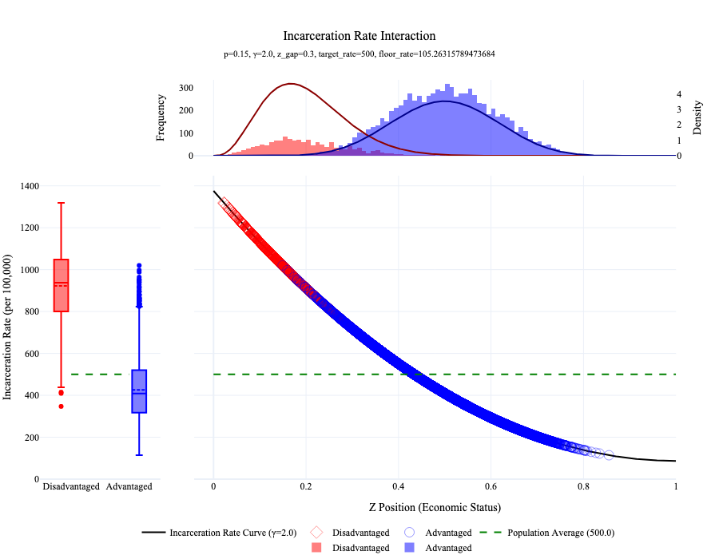
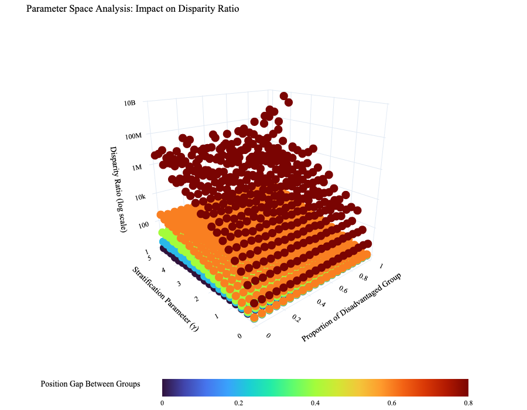
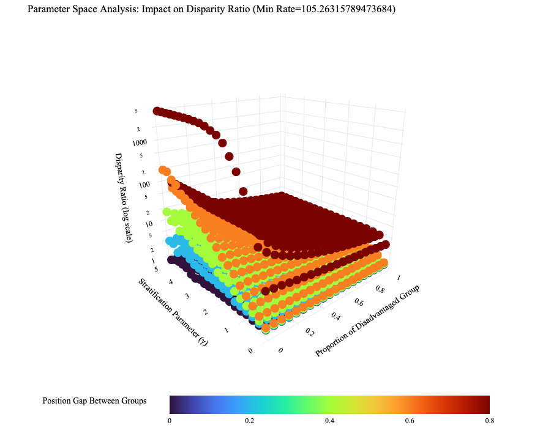
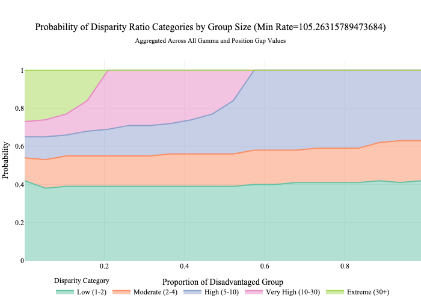

# Indirect Pathway Simulation

This simulation examines how group size influences the measurement of disparities in criminal justice outcomes. We developed a computational model that incorporates two key mechanisms: social stratification (different distributions of advantaged and disadvantaged groups across socioeconomic positions) and position-based incarceration risk (where lower positions face higher risk through a power function relationship).

Our analysis reveals an important distinction between unconstrained and constrained models. In the unconstrained model, disparity ratios remain largely independent of group size, with disparities primarily determined by the position gap between groups and the shape parameter of the position-to-incarceration function. However, when we introduce empirically realistic constraints—specifically a minimum incarceration rate (floor)—the relationship changes significantly. With this floor constraint applied, smaller disadvantaged groups show higher measured disparities than larger disadvantaged groups.

This finding has implications for comparing inequality across jurisdictions with different demographic compositions. The observed differences in disparity measurements may reflect not only differences in underlying structural factors but also mathematical properties of how these metrics behave under realistic constraints. 

## Interactive App

We've created an interactive web application to visualize and explore the simulation results: [Indirect Pathway Simulation App](https://indirect-pathway-simulation-df537e821cdf.herokuapp.com/)

The app allows users to:
- Manipulate simulation parameters in real-time and observe their effects
- View the three key mechanisms of disparity generation separately
- Explore patterns across thousands of simulation runs through the Parameter Space Analysis

## Mechanisms of the Simulation

The indirect pathway model simulates how social stratification affects incarceration rates through a two-step process:

1. **Social Stratification**: Advantaged and disadvantaged groups have different distributions along a socioeconomic position dimension Z
2. **Position-to-Incarceration Function**: An individual's position in Z determines their incarceration risk through a power function

### Social Stratification Mechanism

We model social stratification by generating different position distributions for advantaged and disadvantaged groups using beta distributions:

- For disadvantaged group: $z_i \sim \text{Beta}(\alpha_{disadv}, \beta_{disadv})$
- For advantaged group: $z_j \sim \text{Beta}(\alpha_{adv}, \beta_{adv})$

Where the beta distribution parameters are derived using the mean-concentration approach:
- $\alpha_{group} = \mu_{group} \cdot c_{group}$
- $\beta_{group} = (1 - \mu_{group}) \cdot c_{group}$

The mean position of the disadvantaged group ($\mu_{disadv}$) is lower than that of the advantaged group ($\mu_{adv}$), with the difference controlled by the position gap parameter:

$\mu_{adv} = \mu_{disadv} + z\_position\_gap$

The concentration parameters ($c_{disadv}$ and $c_{adv}$) control how tightly each group clusters around its mean position, with higher values creating more peaked, narrower distributions.

*This graph shows the probability density distributions of the advantaged (blue) and disadvantaged (red) groups across the social position dimension (x-axis). The disadvantaged group is concentrated at lower positions (left side) with a peak around 0.2, while the advantaged group is shifted to higher positions (right side) with a peak around 0.5, illustrating the structural stratification in the model.*

### Basic Position-to-Incarceration Relationship

The core mechanism of the model is a power function that translates position to incarceration risk:

$$\text{PositionEffect}(z, \gamma) = (1-z)^{\gamma}$$

Where:
- $z \in Z = \{z \in \mathbb{R} \mid 0 \leq z \leq 1\}$ represents position in the stratification dimension
- $\gamma \in \mathbb{R}^+$ controls the shape of the relationship between position and incarceration risk

The position effect function has the following properties:
- It equals 1 at the lowest position ($z = 0$) and approaches 0 at the highest position ($z = 1$)
- When $\gamma = 1$: Linear relationship (constant rate of decrease)
- When $0 < \gamma < 1$: Convex curve (steeper drops at higher positions)
- When $\gamma > 1$: Concave curve (steeper drops at lower positions)

### Normalized Incarceration Rate Model

To enable controlled comparisons across simulations, we implement a normalized model that maintains a constant population-average incarceration rate:

$$\text{IncarcerationRate}(targetAvgRate, z, \gamma) = targetAvgRate \cdot \frac{(1-z)^{\gamma}}{\mathbb{E}[(1-Z)^{\gamma}]}$$

Where:
- $targetAvgRate$ is the desired population-average incarceration rate
- $\mathbb{E}[(1-Z)^{\gamma}]$ is the expected value of the position effect across the entire population
- The fraction $\frac{(1-z)^{\gamma}}{\mathbb{E}[(1-Z)^{\gamma}]}$ normalizes the position effect so that its average equals 1

**Important**: This normalization is calculated using the empirical expectation derived from the actual data generated for each simulation run, not from a theoretical distribution. This means that the normalization factor changes based on the specific demographic composition of each simulation, ensuring that the population-wide weighted average incarceration rate remains constant (at targetAvgRate) across all simulation runs. While the shape of the position-to-incarceration curve stays the same, its overall scaling adapts to the specific group distributions in each run.

*This graph displays multiple curves showing how incarceration rates (y-axis, per 100,000) vary with social position (x-axis) for different γ values. Each curve demonstrates a different steepness in the relationship between position and incarceration risk. At γ=2, the curve is highly concave, showing extremely high rates (>2000 per 100,000) for positions below 0.2 that rapidly decrease toward zero for higher positions. The graph illustrates how individuals at lower positions face dramatically higher incarceration risks, especially with higher γ values.*

### Normalized Model with Floor Rate

We further extend the model by introducing a minimum incarceration rate (floor). This addresses the empirically suspect scenario of extremely low incarceration rates for advantaged groups. The floor is applied in a two-step process:

**Step 1:** Calculate initial rates using the normalized model
$$\text{InitialRate}(z) = targetAvgRate \cdot \frac{(1-z)^{\gamma}}{\mathbb{E}[(1-Z)^{\gamma}]}$$

**Step 2:** Apply floor rate constraint
$$\text{RateWithFloor}(z) = \max(floorRate, \text{InitialRate}(z))$$

**Step 3:** Apply second normalization to maintain target average
$$\text{FinalRate}(z) = \text{RateWithFloor}(z) \cdot \frac{targetAvgRate}{\mathbb{E}[\text{RateWithFloor}(Z)]}$$

Where:
- $floorRate$ is the minimum allowed incarceration rate
- The second normalization factor $\frac{targetAvgRate}{\mathbb{E}[\text{RateWithFloor}(Z)]}$ ensures the population-average rate remains at $targetAvgRate$ after applying the floor

This two-step normalization process is critical for maintaining comparable scenarios across simulation runs. When we add a floor, we potentially increase the average rate, so the second normalization factor adjusts all rates proportionally downward to maintain the target average.

*This graph shows the position-to-incarceration rate function with a floor rate of 100 per 100,000 applied. Multiple curves represent different γ values, with the horizontal line at the bottom showing where the floor rate creates a minimum threshold. Unlike the no-floor version, these curves are slightly compressed at the higher rate values to maintain the same population average. The γ=2 curve still shows the steepest decline, reaching approximately 1500 per 100,000 at the lowest positions before flattening to the floor rate at higher positions.*

### Disparity Generation Through Mechanism Interaction

*This three-panel visualization shows how disparities emerge from group position differences (top panel), non-linear incarceration risk (middle panel), and the resulting group rate differences (left panel), with disadvantaged groups (red) experiencing higher rates than advantaged groups (blue).*

This visualization illustrates how the two key mechanisms in our model - stratification in social positions and the non-linear relationship between position and incarceration risk - interact to produce the disparities observed in our simulations. Without any direct discrimination in the incarceration process itself, these structural factors combine to generate substantial group differences in outcomes.

## Simulation Approach

Our simulation explores how key parameters affect observed disparities in incarceration rates. We focus on four critical parameters while holding others constant to isolate their effects:

1. **Group proportion**: $p \in (0.01, 0.99)$ with increments of 0.05
   - Represents the proportion of the disadvantaged group in the population
   - Allows us to examine how group size affects disparity metrics

2. **Position gap between groups**: $z\_position\_gap \in \{0, 0.2, 0.4, 0.6, 0.8\}$
   - The difference between mean positions of advantaged and disadvantaged groups
   - Represents structural stratification in society

3. **Shape parameter**: $\gamma \in [0.1, 5]$ with 20 evenly spaced values
   - Controls the steepness of the relationship between position and incarceration risk
   - Higher values create more severe penalties for lower positions

4. **Floor rate**: $floorRate \in [0, 500]$ with 20 evenly spaced values
   - Minimum incarceration rate before second normalization
   - Introduces an empirically motivated constraint

### Constant Parameters

For parsimony and to better isolate the effects of our key variables, we hold the following parameters constant:

- Mean position of disadvantaged group: $\mu_{disadv} = 0.2$
- Concentration parameters: $c_{disadv} = c_{adv} = 20$
- Target average incarceration rate: $targetAvgRate = 500$ per 100,000
- Sample size: $N = 10,000$ individuals per simulation run

### Disparity Measures

For each simulation, we calculate several disparity measures:

1. **Disparity Ratio**: $d = \frac{\text{GroupRate}_{disadv}}{\text{GroupRate}_{adv}}$

2. **Rate Difference**: $\text{GroupRate}_{disadv} - \text{GroupRate}_{adv}$

3. **Normalized Disparity Index**: $\eta = \frac{d - 1}{d + \frac{1 - p}{p}}$

The Normalized Disparity Index (η) effectively measures how close the advantaged group's rate is to its theoretical minimum. Since it's mathematically impossible for the advantaged group's rate to approach zero while maintaining the same population-wide average when it represents a large proportion of the population, this metric moderates the disparity effect when the disadvantaged group is small. This potenitally provides a more comparable measure across different demographic contexts.

## Key Findings

### Unconstrained Model Results

Our analysis of the unconstrained model (without floor rate) reveals several important insights:

1. **Position gap dominance**: The position gap between groups ($z\_position\_gap$) is the strongest determinant of disparity levels, with higher gaps producing greater disparities.

2. **Gamma amplification effect**: Higher values of the shape parameter (γ) amplify disparities non-linearly, especially when combined with larger position gaps.

3. **Group size-independence of disparity ratio**: The disparity ratio (d) is largely unaffected by group size (p) when no floor constraint is applied. This confirms that the disparity ratio is:
   - A per-capita metric where both numerator and denominator are already normalized by their respective population sizes
   - Not affected by the variance of group-specific economic position distributions (as it's a ratio of means)

4. **Disparity ratio instability at extremes**: The disparity ratio is sensitive to small values in its denominator (i.e., advantaged group's incarceration rate approaching zero):
   - This mathematical property of ratios creates measurement artifacts rather than reflecting meaningful differences in inequality (in the empirically unlikely scenario the advantaged group's rate is close to zero).

*This 3D surface plot shows how disparity ratio (z-axis) varies with group proportion (x-axis) and gamma (y-axis). The color gradient represents the position gap (z_position_gap) between groups, ranging from blue (smaller gaps) to red (larger gaps). This visualization effectively displays four dimensions: the disparity ratio is shown by the height of the surface, while the interaction between the two causal factors (gamma and position gap) and their effect on disparity across different demographic compositions (group proportion) is captured. The plot reveals that in the unconstrained model, disparity ratios remain relatively stable across different group proportions for any given combination of gamma and position gap, but increase dramatically as both causal factors increase. The highest disparities (elevated areas with red coloring) occur when both gamma and position gap are at their maximum values, regardless of group proportion.*

#### Correlation patterns in unconstrained model

Analysis of parameter correlations in the unconstrained model shows:
- Position gap between groups has the strongest positive correlation with disparity measures
- The shape parameter (γ) shows significant positive correlation with disparity ratio
- Group size (p) shows negligible correlation with disparity measures, confirming mathematical independence
- The relationship between parameters is consistent across different disparity metrics

*This correlation heatmap displays the strength of relationships between model parameters and disparity measures. The color scale ranges from dark blue (strong negative correlation) to dark red (strong positive correlation). The position gap shows the strongest positive correlation with all disparity measures (>0.7), while gamma also shows substantial positive correlation with disparity ratio. Notably, group proportion (p) shows virtually no correlation with disparity ratio in the unconstrained model, appearing as a near-zero (light-colored) cell in the heatmap. This confirms the mathematical independence of disparity ratio from demographic composition when no floor constraint is applied.*

#### Probability-based approach to disparity analysis

We reframe our analysis from examining the magnitude of disparities to understanding the *probability distribution* of disparities across different demographic contexts; i.e., **How does the probability of observing different levels of disparity change as the relative size of the disadvantaged group changes?**

When the model runs without floor constraints (allowing mathematically possible but empirically unrealistic near-zero rates for advantaged groups):
- The *probability distribution* of disparity ratios remains largely stable across different group proportions
- This stability confirms the mathematical independence of disparity ratios from group size when no empirical constraints are applied
- Disparities are primarily determined by position gap and gamma, regardless of demographic composition

*This visualization shows the probability distribution of disparity ratios across different disadvantaged group proportions. The x-axis represents the disparity ratio (from 1 to 25+), while different colored lines represent different group proportions from 0.05 to 0.95. In the unconstrained model, these probability distributions largely overlap, showing that the likelihood of observing any particular disparity ratio is similar regardless of group size. This confirms the mathematical independence of disparity ratios from group proportion when no floor constraint is applied.*

### Constrained Model Results

#### The motivation behind introducing the floor rate

We introduced the floor rate constraint primarily for empirical realism:

In real-world criminal justice systems, even the most advantaged groups maintain some minimal level of incarceration. Extremely low or near-zero incarceration rates for advantaged groups are empirically improbable. The floor rate parameter ensures our model reflects this reality by establishing a minimum incarceration rate.

This constraint prevents the model from producing mathematically possible but empirically unrealistic scenarios where advantaged groups have virtually no contact with the criminal justice system.

When we introduce the floor rate constraint, several important patterns emerge:

*This 3D surface plot shows how disparity ratio (z-axis) varies with group proportion (x-axis) and gamma (y-axis) when a floor rate constraint is applied. The color gradient represents the position gap (z_position_gap) between groups, ranging from blue (smaller gaps) to red (larger gaps). Unlike the unconstrained model, this surface shows a strong relationship between group proportion and disparity ratio, with much higher disparities occurring when the disadvantaged group is small (left side of the plot), especially when position gaps are large (red areas). The surface slopes downward as group proportion increases, demonstrating how the floor rate constraint makes disparity ratios sensitive to demographic composition while the interaction between the two causal factors (gamma and position gap) continues to amplify disparities.*

1. **Group size sensitivity**: With a floor rate, the disparity ratio becomes sensitive to group size (p), with significantly higher disparities observed when the disadvantaged group is small.

2. **Floor rate effects**: As the floor rate increases:
   - Maximum observable disparities decrease
   - The sensitivity to group size becomes more pronounced
   - The effects of γ are moderated

3. **Probability distribution shifts**: The probability of observing extreme disparity ratios (>10:1) increases dramatically as the disadvantaged group becomes smaller, especially with lower floor rates.

*Probability distribution showing how the likelihood of different disparity levels changes with group size. As the disadvantaged group becomes smaller, the probability of extreme disparities increases.*

#### Correlation patterns in constrained model

4. **Correlation patterns**: Analysis of parameter correlations shows:
   - Position gap between groups remains the strongest predictor of disparity measures
   - Group size (p) shows significant negative correlation with disparity ratio when a floor is applied
   - The effect of γ is moderated by the floor, but still significant

*Correlation heatmap showing relationships between parameters and disparity measures. Position gap has the strongest effect on disparity measures, but unlike the unconstrained model, group proportion (p) now shows a strong negative correlation with disparity ratio. This demonstrates how the floor rate constraint fundamentally changes the relationship between demographic composition and measured inequality.*

### Comparison Between Models

The contrast between the unconstrained and constrained models reveals important insights about measuring group inequality in punishment:

1. **Mathematical vs. empirical considerations**: The unconstrained model reveals the mathematical properties of disparity measures, while the constrained model better approximates empirically realistic scenarios.

2. **Group size effects**: The models reveal how group size genuinely affects measured disparities under realistic constraints. When a floor rate is introduced, smaller disadvantaged groups systematically show higher disparity ratios because:
   - The floor prevents the advantaged group's rate from falling below a minimum value
   - To maintain the same population-average rate, the disadvantaged group's rate must increase to compensate
   - This mathematical relationship produces higher disparities for smaller disadvantaged groups even when all other causal factors are identical

## Alternative Approaches

### Alternative Normalization Process

An alternative approach we could explore would be to modify the normalization process. Currently, the normalization factor is calculated based on the empirical expectation of the position effect from the generated data. This makes the normalization dependent on the specific demographic composition of each simulation.

Instead, we could use the analytical expectation of the position-to-incarceration function, assuming a uniform distribution across the position dimension. This approach would:

- Make the normalization independent of demographic composition
- Allow the population-average incarceration rate to vary across simulations
- Provide insight into how demographic composition naturally affects overall incarceration rates

The trade-offs between these approaches relate to different research questions:

- **Current approach (empirical expectation)**: Better for understanding how disparities manifest in specific demographic contexts while controlling for overall incarceration rates. This addresses questions about how structural factors produce inequality within a system that maintains constant overall punishment rates.

- **Alternative approach (analytical expectation)**: Better for understanding how demographic composition affects both group-specific rates and overall incarceration rates simultaneously. This addresses questions about how structural factors might influence not just inequality but also the overall scale of punishment in society.

Each approach illuminates different aspects of how indirect pathways generate disparities in punishment.

## Future Directions

### Three-Group Extension

A natural extension of our current binary model would be to incorporate a third "other" group. Currently, our model defines the disadvantaged group proportion as p and implicitly defines the advantaged group as (1-p). This binary framework, while instructive, limits our ability to explore scenarios where both the advantaged and disadvantaged groups represent demographic minorities.

We could extend the model by:

1. Explicitly parameterizing all three group proportions:
   - p₁: proportion of disadvantaged group
   - p₂: proportion of advantaged group
   - p₃: proportion of "other" group (where p₁ + p₂ + p₃ = 1)

2. Assigning the "other" group its own position distribution with mean μ₃ (potentially intermediate between disadvantaged and advantaged groups)

This three-group extension would enable us to model more complex demographic structures that better reflect empirical reality:

- Multi-group societies where population is distributed across several distinct socioeconomic or racial categories rather than just two
- Contexts with varying group proportions, including scenarios where no single group constitutes a clear majority

This extension would help address important measurement questions relevant to real-world societies where the simple binary advantaged/disadvantaged framework fails to capture demographic complexity. It would provide a more realistic test of how our disparity measures perform across a wider range of empirically observed population distributions.

## Relationship to Direct Pathway Analysis

While the direct pathway model performs a mathematical decomposition of how group size affects the relationship between population-average incarceration rates and group-specific rates, this indirect pathway model takes a fundamentally different approach through simulation.

In this model, disparities emerge organically from three interacting components:
1. The shape parameter γ that determines how position in the stratification dimension affects incarceration risk
2. The distributions of advantaged and disadvantaged groups in the stratification space
3. The relative size of the groups (p)

Interestingly, when the model is unconstrained (without a floor rate), it produces results that align with the direct pathway analysis: the disparity ratio is largely independent of group size. This convergence occurs because both approaches are ultimately describing the same mathematical relationships from different angles. The direct pathway approach derives this relationship analytically, while our indirect pathway simulation allows it to emerge from the underlying mechanisms.

The constrained model (with floor rate) then extends beyond the direct pathway analysis by incorporating empirical constraints and revealing how they interact with group size to affect disparity measures. This highlights the complementary nature of these two approaches - one providing mathematical clarity about the fundamental properties of disparity measures, and the other revealing how these properties manifest under more realistic conditions.